# ImageStackAlignator
Implementation of Google's Handheld Multi-Frame Super-Resolution algorithm (from Pixel 3 and Pixel 4 camera)

This project aims in implementing the algorithm presented in “Handheld Multi-Frame Super-Resolution” by Wronski et al. from Google Research (https://doi.org/10.1145/3306346.3323024).

The paper contains several errors and inaccuracies why an implementation is not straight forward and simple. One can only wonder why and how this could have passed the peer review process at ACM, but also the authors never replied my mails trying to get clarification. Nevertheless, I managed to get a working implementation that is capable of reproducing the results. As neither the authors nor ACM seem to be interested in having a corrected version of the paper, I will go through the individual steps and try to explain the reasoning in my implementation. I also improved things here and there compared to the version in the paper and I will point out what I changed.

The algorithm is mainly implemented in CUDA, embedded in a framework able to read RAW files coming from my camera, a PENTAX K3. DNG files are also supported, so many raw files coming from mobile phones should work and most DNG files converted from other camera manufacturers should also work, but I couldn’t test every file. The RAW file reading routines are based on [DCRAW](https://www.cybercom.net/~dcoffin/dcraw/) and the [Adobe DNG SDK](https://www.adobe.com/support/downloads/dng/dng_sdk.html), and just for my own fun I implemented a while ago everything in C# and don’t use a ready-to-use library. As the GUI is based on WPF, you need a Windows PC with powerful NVIDIA GPU to play with the code. Main limitation for the GPU is memory, the more you have, the better. Having an older GeForce TITAN with 6GB of RAM, I can align 50 images with each 24 mega pixels. 

### The algorithm / overview

I will discribe the single steps and my modifications of the algorithm based on that figure taken from the original paper:
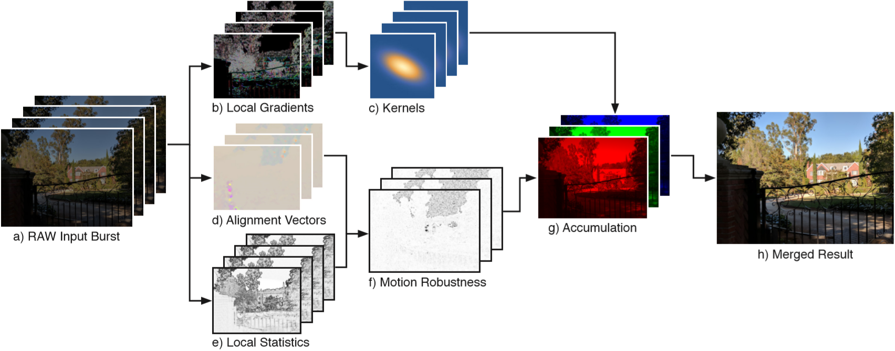

* a\) RAW Input burst: Having a Google Pixel 3 or 4 (or an Android APP accessing the camera API) one could get a burst of RAW files in sort of a movie mode, meaning no physical interaction is necessary to record the next image. Here instead, I simply rely on RAW images that are either taken manually or in a burst mode on a SLR. The major difference is, that we have much larger movements in the latter case due to the increased time gap in-between the single frames. I will compensate for this by using a global pre-alignment before running the actual algorithm.

* b\) and c\) This part is described in chapter 5.1 of the paper and many things don’t fit together here. Given that this section is sort of the main contribution of the paper, I can’t understand how this can be so wrong.\
 The first inaccuracy is about the number of frames used in this step. “We compute the kernel covariance matrix by analyzing every frame’s local gradient structure tensor” together with the picture above showing multiple frames at step b), which indicates that for each frame a structure tensor (for each pixel) is computed independently of all the other frames. Whereas a bit before it is said “Instead, we evaluate them at the final resampling grid positions”. Given that in an ideal condition all frames should be perfectly aligned on the final resampling grid and that this final resampling grid is just the reference image, i.e. the one frame that doesn’t move, the only reasonable way to compute the local gradients and kernels is to use only the reference frame. In this implementation, only the reference image is used to compute the reconstruction kernels.\
 The idea of the reconstruction kernel is to use as many sample points in one frame as possible to reconstruct a pixel in the final image with reduced noise level. But without the destruction of image features. To do this, one uses the information of the local gradients to compute a structure tensor which indicates if the pixel shows an edge like feature, a more point like feature or just a plain area without any structure. For a fine point no neighboring pixels can be used to reconstruct the final pixel, but a line or edge can be averaged along the direction of edge and in a flat area everything can be taken together.\
 The eigen values of the structure tensor can be used to determine the “edginess” of a pixel. For some weird reasons the authors claim that the simple ratio 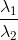 with  and  being the eigen values of the structure tensor, corresponds to that information, and even more, they claim that the ratio is in the range [0..1]. They explicitly write that  is the dominant eigen value, thus  < , why the ratio  is always > 1. In common literature the “edginess” indicator is given by 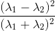. Using this instead of just , e.g. in the equation for the term A in the supplementary material, works well and seems to be the desired value.\
 For me there’s no reasoning in limiting oneself to only a reduced resolution source image to computed the local structure tensors. Instead of using a sub-sampled image as done in the paper, I use a slightly low-pass filtered full-resolution image coming from a default debayering process and then converted to grayscale. Instead of using tiles of 3x3 and computing the structure tensor only for each single tile, I gaussian-smooth the gradients and compute a structure tensor for each pixel at full resolution.\
 Further, I chose the size for the kernel as 5x5 and not 3x3. Why? Because I can… There’s no real reasoning behind that choice apart from seeing what is happening (mainly nothing).
* d\) This part is the same as published in “Burst photography for high dynamic range and low-light imaging on mobile cameras” from Hasinoff et al. where the authors use a L2 difference to find displacements of patches at several scales and at the final full resolution scale they use a L1 difference to find a displacement of only one remaining pixel. This is mainly due to implementation details and to boost performance. The shift of each tile is only computed once, the shift from one frame to the reference frame. This is prone to outliers and errors. Here in this implementation, on the other hand, we don’t have the restrictions of the environment of a mobile phone, we have a big GPU available, so let’s get things done right.\
As already mentioned before, I perform a global pre-alignment, which means that every frame is aligned entirely using cross-correlation towards the first frame of the stack. Further I also search for small rotations by choosing the rotation with the highest cross-correlation score. There’s no magic in here, just a simple brute force approach. This also gives us the final reference frame, given that we can choose the one frame as reference that minimizes the global overall shifts.\
Once all frames globally aligned, we move on to patch tracking, potentially on multiple resolution levels. For all levels I stick to L2 norm using cross-correlation, the same way as Hasinoff et al. on the lower levels.\
Instead of computing the shift only from one frame to the reference frame (independently for each tile), one can also make use of further dependencies: The movement of one tile to the next frame, and the movement of this frame to the third frame, should be equal to the direct movement of frame 1 to frame 3. A principle e.g. published by Yifan Cheng in "Electron counting and beam-induced motion correction enable near-atomic-resolution single-particle cryo-EM", doi:10.1038/nmeth.2472. By measuring multiple dependent shifts to finally obtain the sequential shifts from one frame to another, allows to detect and reject outliers and get a substantially better displacement field.\
To obtain sub-pixel displacements I use the same interpolation method as described by Hasinoff et al., even though I believe that spline interpolation should give better results. Because I wanted to try that one out, I implemented it and sticked to it here, given that only half a pixel precision is needed and only for super-resolution (no down-scaling in my implementation).\
Because of the outlier rejection during alignment, I can omit the M threshold of equation 7 in the paper.\
Additionally, if patch tracking doesn’t find a reasonable peak to determine the shift, it falls back to zero shift. Thus, either the shift from the previous level is unchanged or the shift from global pre-alignment is used as last fall back. As this usually happens in flat areas without features, this seems a reasonable way to go.\
Another part not mentioned at all in any of these Google research papers is the effect of high-pass filtering the images. Obviously for good alignment one applies some gaussian smoothing prior to patch tracking to reduce noise. But images also contain a lot of low frequent noise, I guess mainly due to some read-out characteristics and read-out noise. I saw especially for long exposure images an increased low frequent fixed pattern that made precise tracking impossible. I thus include a high-pass filter prior to tracking.
* e\) and f\) Here things start to be described relatively well in chapter 5.2, but then in the text just before equation 6, I’m getting lost. I am not familiar with the term “Wiener shrinkage” and in the referenced paper from Kuan et al. the term “shrinkage” isn’t mentioned once. I assume that sort of a Wiener filter is used as one can see in equation 6. The description for 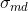 is wonderful: “We obtain  and 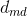 through a series of Monte Carlo simulations for different brightness levels…”. No further explanations… Well, what they actually meant, I guess: obtain  from the noise model described in Foi et al., a paper mentioned just a chapter before:
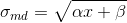 with  and  being the model parameters and  the brightness value. (This is the model without clipping but the one I used as I don’t have determined the clipping parameters for my camera.)\
And for  I haven’t figured out what this is supposed to represent, at least in equation 6 I don’t see how this fits.\
Given two patches of some mean value but both affected of noise with the same standard deviation . The distance is then the difference but affected with noise of a standard deviation of 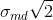. Same holds for the measured distance 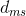. Assuming the real distance between the patches is small, (otherwise no need for the Wiener filtering step), one can replace  by 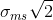 and  by . Putting this in the equation 6 the 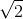 term cancels out and  is just Wiener filtered by 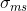 and , two values that we already have determind. This is what I have done in my implementation.
* g\) and h\) Having all the previous bricks together, the actual merging part is straight forward. In case of super-resolution I restrict my self to only the central part of the unscaled image because for a 24 mega pixel image this would get a bit too much data… I heavily make use of the NPPi library coming with CUDA, and there the maximum image size seems to be restricted to 2 Gigabytes. 

### The application: Aligning an image stack

1) Click on “Select images...” to open a few RAW images. If you click on a file in the list you can see a simple debayered preview image in the left image pane. Note that image size and exposure time should be identical in all files (this is not verified...)!\
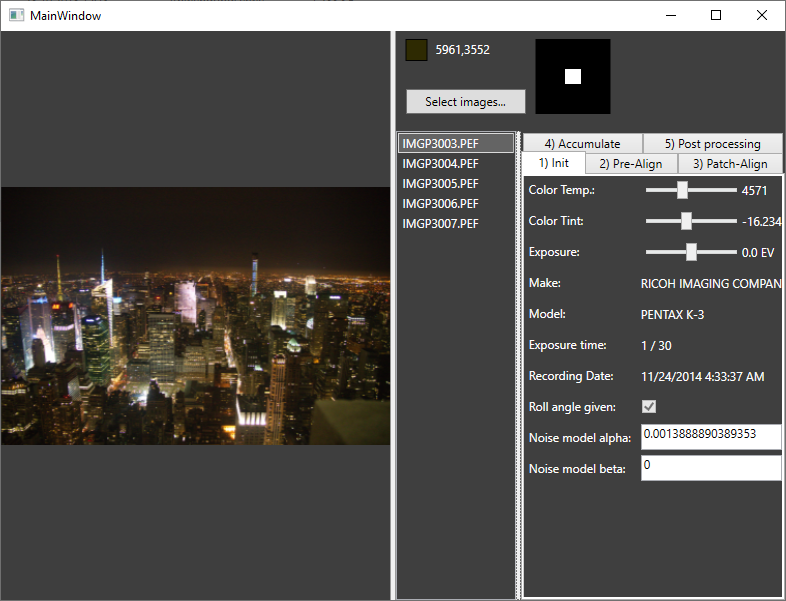
2) The pre-align tab allows to set the following settings:\
**Sigma LP:** the standard deviation for a gaussian blur filter (in real space)\
**High pass:** The cut-off frequency for a high pass filter in Fourier space as radius (maximum is thus 0.5, but limited to reasonable values here).\
**HP sigma:** Standard deviation of the blur of the previous cut-off frequency.\
**Clear axis:** Sets the pixels with the given distance to the main axis to zero in Fourier space. This was for some testing and shouldn’t be used.\
**Green channel only:** Create the B/W image only using the green channel and not a weighted average of RGB. Might help in case of heavy chromatic aberrations.\
**Rot range and incr.:** the range (+/- the value) and search increment for rotational search. Pentax camera measure an absolute roll angle during acquisition, why this search then only tries to determine a small offset. For other cameras the values must be chosen larger.\
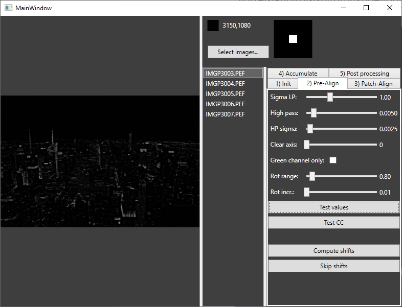
Clicking on **Test values** or **Test CC** shows the selected image filtered with these parameters or performs a cross-correlation check where one image is intentionally shifted by 5 pixels and this shift must be found by cross-correlation.\
Finally click on **Compute shifts**. Browsing through the files shows them now including pre-alignment.\
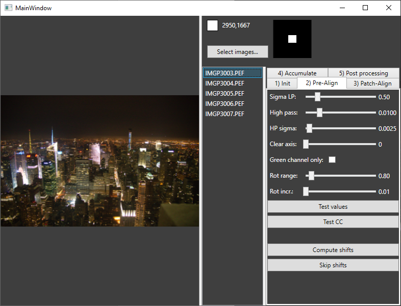
3) Having done the pre-alignment, we move on to patch tracking. First, we define the patch sizes, scaling factors and maximum allowed shift per frame.\
**Reference** chooses the reference image to use. By default this is the one determined in the step before.
**Block size** is the size of a block to measure the displacements.
Choosing strategy **Full** cancels out the block size parameter as the entire series is one big block. But memory is restricted and you might run out of memory if choosing **Full** for large image stacks. **Only on reference** is the simple tracking routine as used by Google research, **On reference block** groups images of **block size** around the reference frame and every frame is compared to each frame in the block. **Blocks** measures distances only in frames inside a moving block around the current frame. The reference frame is neglected here.
**Threshold:** If the minimum L2 distance plus the threshold is larger than the maximum L2 distance of the same patch (for a different shift), the found shift is set to zero. This filters out flat areas.
After **Track patches** one can inspect the result by clicking on **Show tracked patches**. By switching between reference frame and another frame one can verify the correct tracking. The checkbox **Include pre-alignment** adds the pre-alignment to the shift vector and removes it from the image.\
It is to note that **Max. Shift** has to be given as the desired value + 1 as the largest shift in the displacement / cross-correlation map cannot be used due to the interpolation. For a value of 2 the largest possible shift is thus 1.5 pixels.\
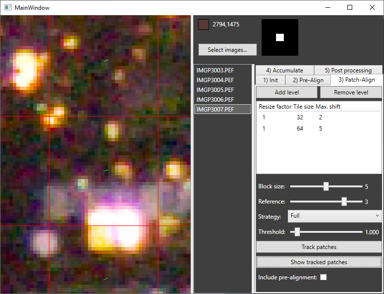
4) Accumulation:\
**Sigma ST:** standard deviation to blur the derivates to compute the structure tensor.\
**Sigma LP:** standard deviation to apply before computing the deviations. (This time no high-pass filter is applied)\
**Dth**, **Dtr**, **kDetail**, **kDenoise** are parameters as described in the paper. In short: on the left side for low noise pictures, on the right side for noisy pictures.\
**Iteration LK:** How many iterations of Lucas-Kanade optical flow to perform for final precise alignment.\
**Window LK:** The window size for Lucas Kanade.\
**Min. Det. LK:** Determinant threshold for Lucas Kanade. If the matrix in Lucas-Kanade has a eigen value smaller than the threshold, no shift is applied.\
**Erode size:** Size of the erosion kernel in the uncertainty mask.\
After clicking on **Prepare accumulation** one can inspect the reconstruction kernel for every pixel my moving the mouse over the image.\
Clicking then on **Accumulate** adds the selected images to the final result. This way one can add one image after the other, but also all images at once by selecting them all together. This helps debugging...\
If **Clear results** is set, the final image buffer is cleared before every new image added.\
**Super resolution** activates the super resolution feature, resampling the final image at double the original resolution. When changing this flag, **Prepare accumulation** must be done again!\
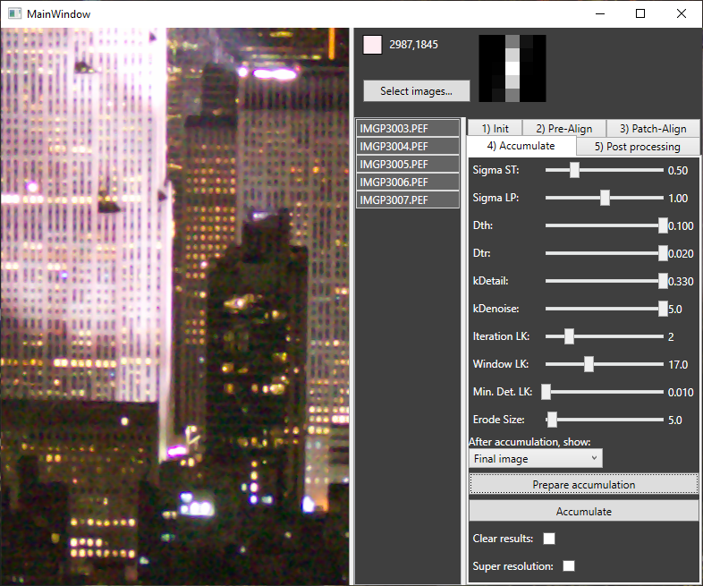
5) Finally, the last tab takes the result buffer from the step before, applies the chosen tone curve and color settings and allows to save the result as a 16 bit TIFF image.\

### Some results

#### New York scene - 5 frames

Reference frame decoded with Adobe Camera RAW:

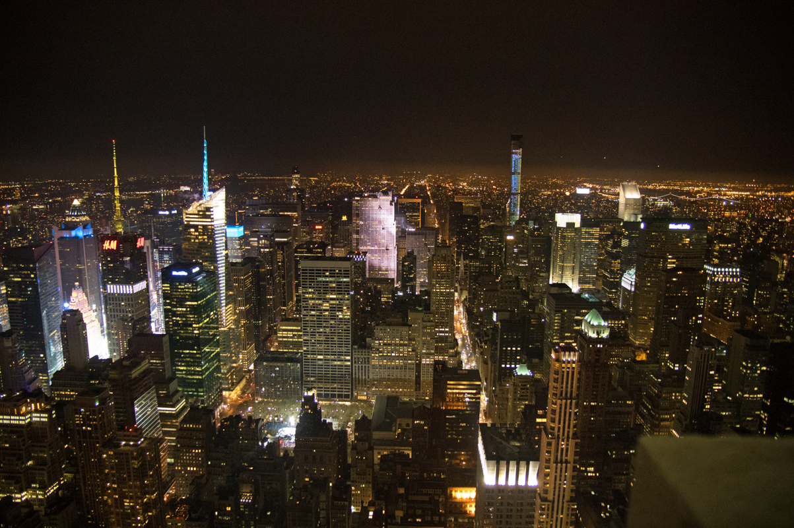

Merge of 5 frames using this implementation (The applied tone curves differ a little):

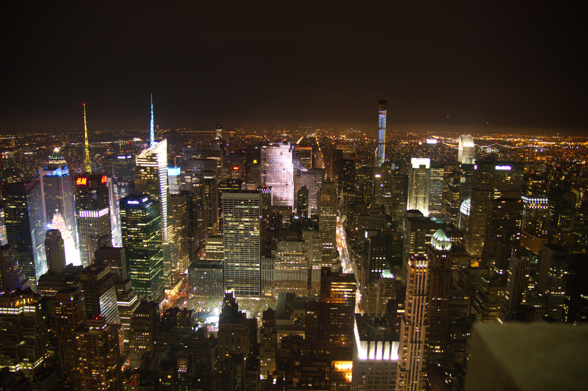

Reference frame decoded with Adobe Camera RAW (Crop 1:1):

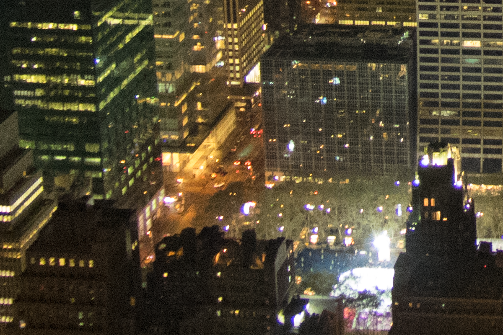

Merge of 5 frames using this implementation (Crop 1:1):

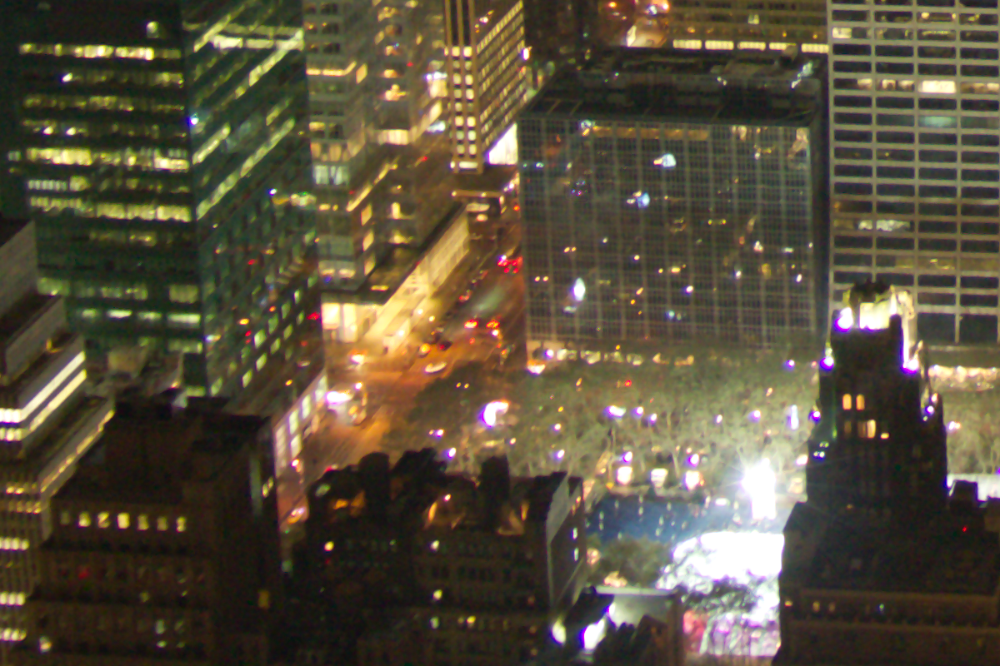

#### Super-Resolution test chart with a Samsung Galaxy S10e (20 frames)

Area Cropped:

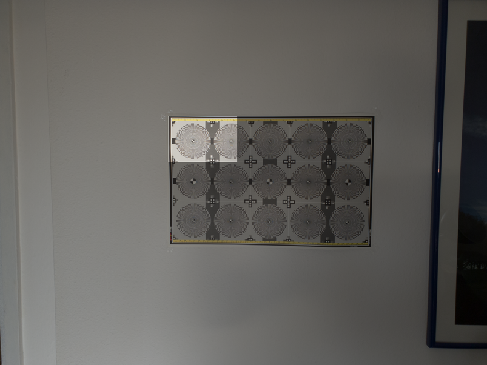

Merge of 20 images in super-resolution mode:

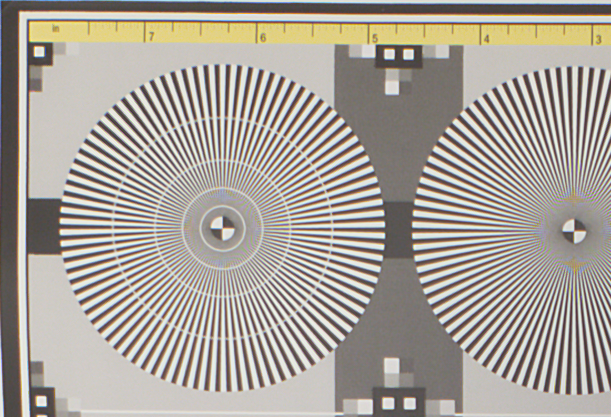

Developped DNG (reference frame) using Adobe Camera RAW (resized by factor 2 using bicubic interpolation):

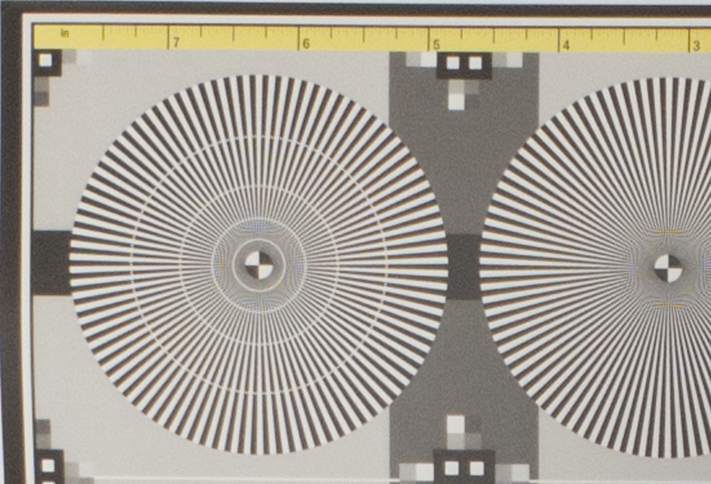

Out of camera JPEG (resized by factor 2 using bicubic interpolation):

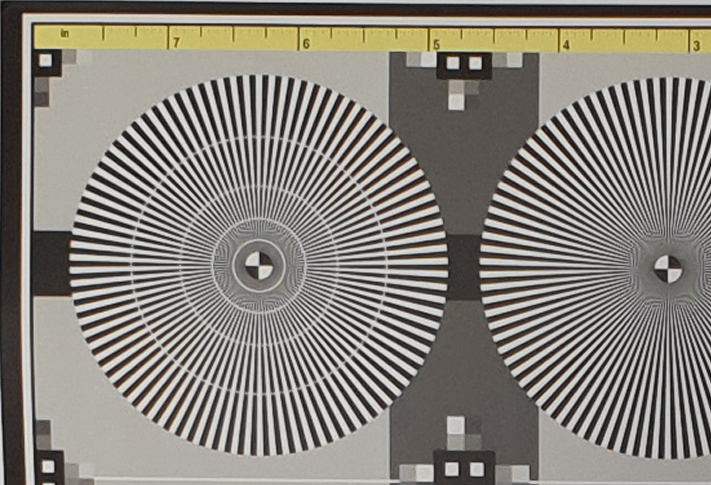

#### Night sky at Grand Canyon (34 frames with 10 second exposure each)

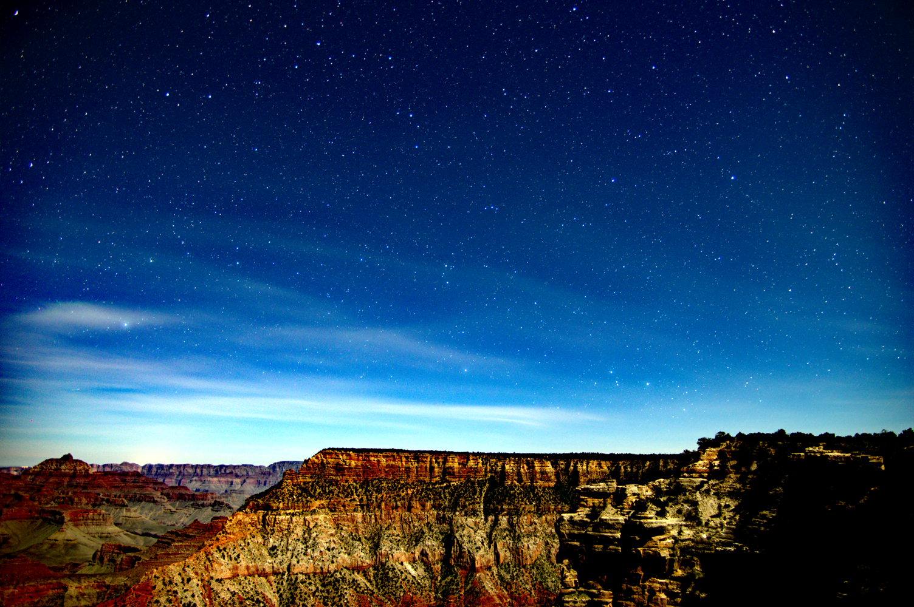
